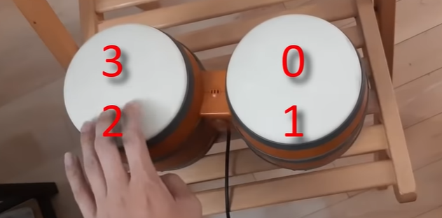

# Donkey Kong Bongo To Key

A keyboard & mouse interface for the Donkey Kong Bongos DOL-021 as seen in [The Title of this Video was Typed with Donkey Kong Bongos
](https://www.youtube.com/watch?v=ueZaTTSFU28)

## Requirements
 * Donkey Kong Bongos for GameCube
 * GameCube Controller Adapter to PC (Mayflash, ClouDream, etc.)
    * Alternatively: GameCube Controller Adapter to Wii U/Switch (Official Nintendo Adapter) + [GameCube Adapter Driver for PC](http://m4sv.com/page/wii-u-gcn-usb-driver)
 * Windows 10

## Use
 * Clap toggles between keyboard and mouse control
#### Keyboard
 * Buttons 1 to 4 (sensors on the surface of the bongos) are assigned to digits 1 to 4, which are assigned to the base-4 representations of the virtual key codes
 * Start/Pause button toggles keys held down
#### Mouse
 * Buttons 1 to 4 assigned to up/down/left/right mouse movement
 * Both left sensors held down at the same time assigned to left click
 * Both right sensors held down at the same time assigned to right click
 * Start/Pause button toggles mouse buttons held down